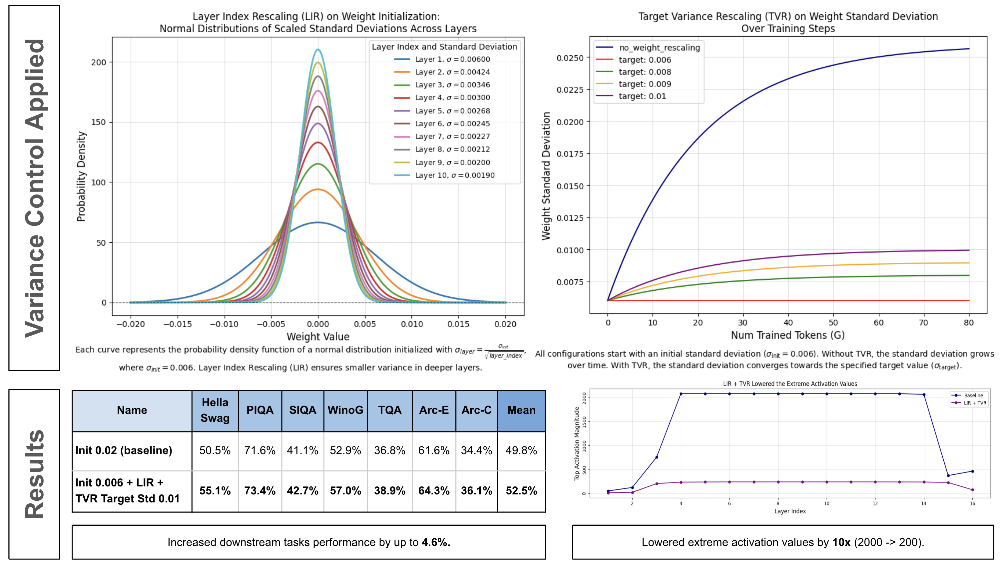
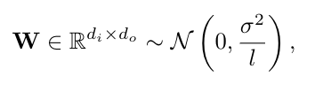
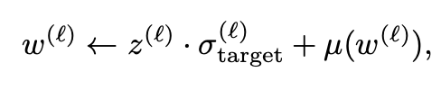

# Variance Control via Weight Rescaling in LLM Pretraining

Official PyTorch Lightning implementation of our paper:

<b>Variance Control via Weight Rescaling in LLM Pretraining</b>

[Louis Owen](https://www.linkedin.com/in/louisowen/), [Abhay Kumar](https://www.linkedin.com/in/akanyaani/), [Nilabhra Roy Chowdhury](https://www.linkedin.com/in/nilabhraroychowdhury/), [Fabian Güra](https://www.linkedin.com/in/guera/) 

BluOrion

[Paper](https://arxiv.org/abs/2503.17500)



This paper explores the vital role of initializing and managing the standard deviation of weights during LLM training. Our findings demonstrate that better variance management yields substantial improvements in downstream task performance (up to 4.6%) and reduces extreme activation values, thereby mitigating challenges associated with quantization and low-precision training.

## Implementation Details

Our code is built within the [PyTorch Lightning](https://lightning.ai/docs/pytorch/stable/) framework, utilizing its callback system for efficient integration into the training pipeline. 


## Layer Index Rescaling (LIR)



, where `l` is the layer index. The code for LIR can be found in [patches/initialization.py](weight_rescaling/patches/initialization.py)

### Example Usage

The code is written as patch, so you need to pass your model to the patch and it will perform inplace operation. If you have other patches, please make sure to apply this patch the last.

#### Llama with LIR
```python
from weight_rescaling import re_initialize_model

re_initialize_model(model, # HF class model; LlamaForCausalLM
                    model_layer_path="model.layers",
                    initializer_range=0.006,
                    scale_with_depth=True, #LIR
                    nlayer_config_name="num_hidden_layers",
                    )
```

#### Llama with Special Init Residual (GPT-2)
```python
from weight_rescaling import re_initialize_model

re_initialize_model(model, # HF class model; LlamaForCausalLM
                    model_layer_path="model.layers",
                    initializer_range=0.02,
                    scale_with_depth=False,
                    special_init_residual_module_names=["o_proj","down_proj"],
                    nlayer_config_name="num_hidden_layers",
                    )
```

#### GPT-2 with LIR
```python
from weight_rescaling import re_initialize_model

re_initialize_model(model, # HF class model; GPT2LMHeadModel
                    model_layer_path="transformer.h",
                    initializer_range=0.02,
                    scale_with_depth=True, #LIR
                    nlayer_config_name="n_layer",
                    )
```

## Target Variance Rescaling (TVR)



The code for TVR can be found in [callbacks/tvr.py](weight_rescaling/callbacks/tvr.py)

### Example Usage for TVR

The Target Variance Rescaling is implemented as Lightning [callback](https://lightning.ai/docs/pytorch/stable/extensions/callbacks.html), making it easy to plug into existing training configurations with minimal changes. This modular approach allows for clean separation between the core model architecture and the variance control mechanisms, facilitating experimentation with different rescaling strategies across various model sizes and architectures.

```python
import lightning as pl
from weight_rescaling import TVRCallback
from weight_rescaling.utils.utils import get_layers

layer0 = get_layers(model, fv["model_layer_path"])[0]
valid_2d_module_names = [
    name
    for name, module in layer0.named_modules()
    if hasattr(module, "weight") and len(module.weight.shape) == 2
]

callbacks = []
callbacks.append(
                TVRCallback(
                    valid_2d_module_names=valid_2d_module_names,
                    additional_module_names_to_log=["input_layernorm","post_attention_layernorm","lm_head","model.norm","model.embed_tokens"],
                    target_std=0.01,
                    scale_with_depth=False,
                    layer_path="model.layers",
                    step_interval=fv["weight_rescaling_step_interval"],
                )
            )

# Pass the callback to your Lightning trainer
trainer = pl.Trainer(
        ...
        callbacks=callbacks,
        ...
    )
```

## Citation
```
@misc{owen2025variancecontrolweightrescaling,
      title={Variance Control via Weight Rescaling in LLM Pre-training}, 
      author={Louis Owen and Abhay Kumar and Nilabhra Roy Chowdhury and Fabian Güra},
      year={2025},
      eprint={2503.17500},
      archivePrefix={arXiv},
      primaryClass={cs.LG},
      url={https://arxiv.org/abs/2503.17500}, 
}
```
